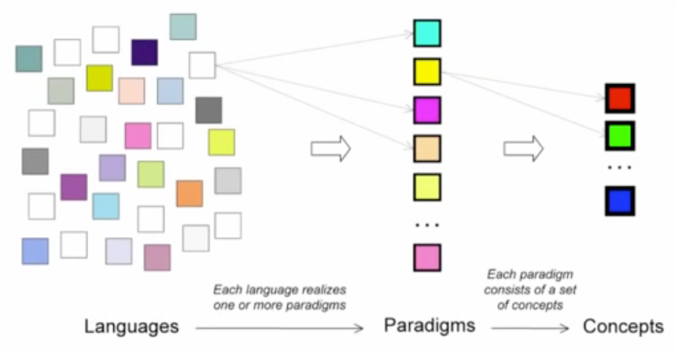

# Introduction
## Идея курса
Языки программировании основаны на парадигмах программирования. Языков много, парадигм (популярных) — несколько. Освоив парадигмы мы сможем достаточно легко осваивать разные языки, которые на них основаны. Более того, разные парадигмы основаны на определенных концепциях, которые могут быть общими у разных парадигм:



## Что такое парадигма?
Парадигма программирования — подход к программированию ЭВМ, основанный на определенном наборе принципов или математической теории.

Функциональная парадигма основана на лямбда исчислении, параллельное программирование — на [пи-исчислении](https://ru.wikipedia.org/wiki/Пи-исчисление), ООП базируется на ряде принципов по структурированию и обработке информации.

Программы пишут, чтобы решать определенные задачи. Разные программы по-разному решают задачи. Для решения разных задач подходят разные парадигмы.

Как в строительстве дома нужно сделать отопление, электрику, коробку поставить, оштукатурить, пол положить и пр., так и в создании программного продукта нужно решать разные задачи: интерфейс, бэкенд, тестирование и пр.

Тут главное то, что разные парадигмы (языки) в системе должны взаимодействовать друг с другом. Это сложно показать при обучении, используя разные языки, поэтому выбрали один мультипарадигмальный язык — Oz, специально созданный для обучения.

## Пять парадигм
В курсе рассматриваются:
* Functional programming
* Object-oriented programming
* Deterministic dataflow
* Multi-agent dataflow
* Active objects (Multi-agent + OOP)

## Декларативное программирование
Исторически вся информатика стремится к декларативности, чтобы в программе описывать результат, а не процесс его достижения.

### Long term view
Описываем, что хотим в результате, а не то, как это нужно делать.

**Если императивное — это команды (commands), то декларативное, это свойства результата (properties).**

### Short term view
Декларативный подход использует математические концепции: функции, отношения (relations, реляционное исчисление).

**Императивное основано на изменении состояния (stateful), декларативное его не изменяет (stateless).**

Functional programs do not have any internal memory, they are stateless.

_Confluency, конфлюэнтность_ — свойство единственности окончания. Обеспечение однозначности вычислений множеством функций, исполняемых в произвольном порядке. ...which means that if you have a large program built out of functions that are composed together, we can evaluate in any order and get the same result.

_Referential transparency, чистота ЯП_ — отсутствие побочных эффектов, детерминированность (чистые функции).

* Функциональные языки: Lisp, Scheme, Haskell, ...
* Логические языки (реляционные): SQL, Prolog, ...
* Комбинации: XSL (форматирование), XSLT (трансформирование)

Это программирование без изменения состояния (without state). Нельзя изменять значение структур данных, нет переменных, только константы.

## Our first paradigm: functional programming
Самая простая парадигма, основа для других, форма декларативного программирования.

### Основные преимущества
Стабильность. Функции не меняются. Все действия происходят не в самих функциях, а в аргументах.

Т. к. состояние не меняется, то легко тестировать.

Stateless server — куки. Они хранятся на машине пользователя, а не на сервере.

### Single Assignment
Однажды присвоенное значение для идентификатора не может быть изменено в ФП. По факту можно присваивать значение, но только то же самое.

Переменные (на самом деле нет):

```oz
declare
X = 123
{Browse X}
```

`declare` говорит, что нужно создать переменную (область памяти) со значением `123`, на которую будет указывать `X`.

`X` тут — идентификатор. Есть при этом еще переменная в памяти, привязанная к значению `123` и связь (link) между ними. Эта связь — окружение (environment). Технически окружение — внутренняя функция (часть семантики языка), которая принимает идентификатор и возвращает значение из памяти: `E(X) = x`.

`declare` создает связь между идентификатором `X` и значением до конца программы или до переназначения (redeclaration). Так работает:

```oz
declare
X = 1
{Browse X}

declare
X = 2
{Browse X}
```

Так ошибка:

```oz
declare
X = 1
X = 2 % error, нельзя переопределять идентификаторы, только переназначать с помощью declare
```

### Скоуп, ограничение области видимости:

```oz
% вариация `declare`,
% ограничиваем область видимости (определяем scope) `X` от `local` до `end`
local X in
   X = 32
   {Browse X}
end

{Browse X} % 3
```

`declare` и `local` — одной природы. Только `local` ограничивает область видимости.

`local` позволяет распознать ограничение области видимости в тексте программы. Это называется `lexical scoping` или `static scoping` (лексическое или статическое окружение).

`local` определяет составную инструкцию (compound instruction).

## Математика
### Numbers
*Exact numbers* — integers

*Approximate numbers* — floating point

Нет автоматической конвертации. Нужно использовать `IntToFloat` и `FloatToInt`. Работает принцип, что нельзя смешивать разные концепты представления данных: точные числа (integers) и приблизительные (плавающая точка, которые компьютер представляет с некоторыми погрешностями).

### Operations
`/` — float division
`div` — integer division (только для integers, отсекает плавающую точку)
`mod` — остаток от деления (только для integers)

## Функции/процедуры
Запуск функции, по синтаксису похож на Лисп, только скобки фигурные:

```oz
{Browse 11*11}
```

`Browse` — имя процедуры (открывает окно Oz-браузера).

```oz
declare
X=12*34
{Browse X}
```

Тут `X` — это идентификатор, который ссылается на переменную, которую на самом деле не видно и она содержит значение `12*34`. Всегда начинается с Прописной. С прописной потому, что под идентификаторами скрываются символьные константы, которые пишутся с маленькой буквы. И значение идентификаторов вызываются через функцию окружения: `E(X)=>x`.

Определение функции:

```oz
declare
fun {Sqr X}
    X * X
end

{Browse {Sqr 10}}

declare
fun {SumDigits N}
    (N mod 10) + (N div 10) mod 10 + (N div 100) mod 10
end

{Browse {SumDigits 999}}
```

### Function Composition
Функциональная композиция — когда в одной функции используется другая. Позволяет разделять систему на слои. Первый шаг к абстракции данных:

```oz
declare
fun {SlowComputation X Y}
   {Delay 1000}
   X + Y
    % Do something
end

{Browse
 local X in
    X = {SlowComputation 1000 1}
    X + X + X
 end
}
```

### Рекурсия
Возможность функции вызывать саму себя. Нужно не забывать про терминальное условие (когда нужно завершить рекурсию):

```oz
declare
fun {SumDigitsR N}
   if (N == 0) then 0
   else
      (N mod 10) + {SumDigitsR (N div 10)}
   end
end

{Browse {SumDigitsR 1234}}
```

### Полнота по Тьюрингу
Язык, в котором можно производить математические вычисления, создавать ф-и, из одной ф-и вызывать другую и реализовать рекурсию называется тьюринг-полным. То есть он умеет делать то, что делает машина Тьюринга.
