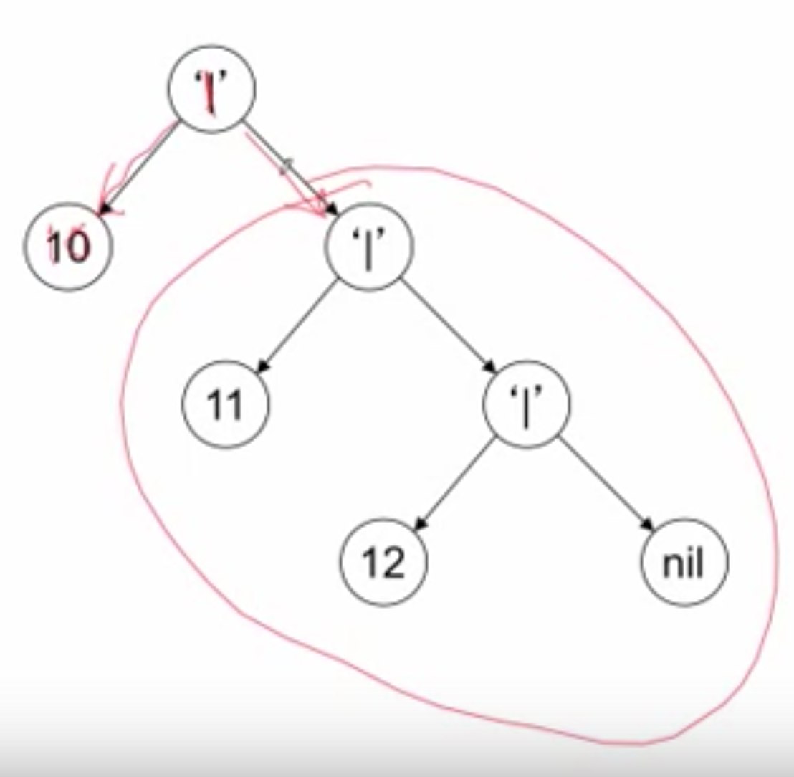

# Lists and pattern matching

## Lists
Составные типы данных (compound data type).

Списки придумали в Лиспе.

Лист — рекурсивный тип данных, определяется в терминах самого себя. Лист — это пустой лист (nil, null) или элемент за которым следует еще один список.

Из Racket: list is recursively defined: it is either the constant null, or it is a pair whose second value is a list.

Похоже, в Озе по-другому, чем в Липе. В лиспе все — пары, в Озе — последовательность.

```
<List T> ::= nil | T '|' <List T>
```

`'|'` — это часть синтаксиса. То есть в Oz синтаксис для определения списка такой:

```oz
declare
L = 1|2|3|nil % список из трех элементов
M = [1 2 3] % то же самое, синтаксический сахар, менее формально
{Browse L == M} % true
```

Представление списка `[10 11 12]`:

```
10 | <List <int>>
10 | 11 | <List <int>>
10 | 11 | 12 | <List <int>>
10 | 11 | 12 | nil
```

Графическое представление:



Список — случай дерева.

## Операции со списками
```oz
X1 = [1 2 3]
{Browse X1.1} % 1, Head / car
{Browse X1.2} % [2 3], Tail / cdr
```

Рекурсивные функции хорошо работают с рекурсивными типами данных. Например, сумма элементов списка:

```
declare
fun {Sum L}
    if L == nil then 0
    else L.1 + {Sum L.2} end
end

{Browse {Sum [1 2 3]}}
```

Т. к. список — рекурсивная структура, то мы не можем напрямую взять N-й элемент.

## Calculating with lists
### Tail recursion for lists
Поэтапное создание списка:

```oz
declare X1 X2 in
X1 = 6|X2

{Browse X1}

declare X3 in
X2 = 7|X3

X3 = nil

{Browse X1}

% Built in functions for lists
{Browse X1.1} % 6, head/car of list
{Browse X1.2} % [7|nil], tail/cdr of list
{Browse X1.2.1} % 7
```

Список — рекурсивная структура данных. Для работы с ним используются рекурсивные функции:

```oz
% Recursive funciton on list
% Sum of elements
declare
fun {Sum L}
   if L == nil then 0
   else L.1 + {Sum L.2} end
end

{Browse {Sum X1}}

% Tail-recursive sum
declare
fun {SumT L Acc}
   if L == nil then Acc
   else {SumT L.2 Acc + L.1} end      
end
{Browse {SumT X1 0}}
```

Получить N-й элемент списка напрямую нельзя, т. к. список — это значение, за которым следует еще один список. Нужно использовать рекурсию:

```oz
% Nth element of a list
declare
fun {Nth L N}
   if L == nil then 'Index is too big'
   elseif N == 1 then L.1
   else {Nth L.2 N - 1} end
end

declare
List = [4 1 8 9 5 7 3]
{Browse {Nth List 30}}
```

## Задача Fact
См. `fact.oz`.

Some of your friends may have already ask you to give the result of 5!. In this exercise, we will solve this problem: we will ask you to provide a list of factorial numbers, once for all! A factorial number x! is defined by: x! = x*(x-1)*(x-2)*...*1

This exercise is focused on the use of lists. Lists can be represented in several forms. For instance:

[a b c] == a|b|c|nil == '|'(1:a 2:'|'(1:b 2:'|'(1:c 2:nil)))
In this exercise, you are asked to produce a list containing the n first factorial number, starting with {Fact 1}. For instance, {Fact 4} has to return [1 2 6 24].


## Pattern Matching
```oz
% Not tail recursive
declare
fun {Sum L}
   case L
   of H|T then H + {Sum T}
   [] nil then 0
   end
end

{Browse {Sum [5 6 7]}}

% Tail recursive
declare
fun {Sum2 L Acc}
   case L
   of H|T then {Sum2 T Acc + H}
   [] nil then Acc
   end
end

{Browse {Sum2 [5 6 7] 0}}

% Pattern engineering
% Make less recursive calls
declare
fun {Sum3 L Acc}
   case L
   % Здесь первый и второй паттерны пересекаются
   % Нельзя их поменять местами, первый включается во второй
   % В идеале все паттерны должны быть сами по себе
   of H1|H2|T then {Sum3 T H1+H2+Acc} % хапаем по 2 элемента сразу
   [] H|T then {Sum3 T Acc + H} % если двух не осталось, то берем один
   [] nil then Acc
   end
end

{Browse {Sum3 [5 6 7] 0}}
```

## List functions and the kernel language
Kernel languare — способ описать пардигму программирования. Так, любая программа, написанная в функциональном стиле может быть представлена в виде общих понятий kernel language.

Kernel languare для Oz (почти полный):

```
<s> ::= skip
        | <s>1 <s>2
        | local <x> in <s> end
        | <x>1=<x>2
        | <x>=<v>
        | if <x> then <s>1 else <s>2 end
        | proc {<x> <x>1 ... <x>n} <s> end | {<x> <y>1 ... <y>n}
        | case <x> of <p> then <s>1 else <s>2 end
           <v> ::= <number> | <list> | ...
           <number> ::= <int> | <float>
           <list>, <p> ::= nil | <x> | <x> ‘|’ <list>
```


## Append
```oz
declare
fun {Append L1 L2}
   case L1
   of nil then L2
   [] H|T then H|{Append T L2} end   
end

{Browse {Append [1 2] [3 3 3]}}
```

Эта же функция на kernel language:

```oz
declare
proc {Append L1 L2 L3}
   case L1 of nil then L3=L2
   else case L1 of H|T then
       local T3 in % Unbound variable
          L3=H|T3
          {Append T L2 T3}
       end
    end
   end
end
local R in {Append [1 2 5] [8 7 6] R}
   {Browse R}
end
```


Благодаря тому, что изначально `T3` не определена функция `Append` является хвостовой рекурсией.